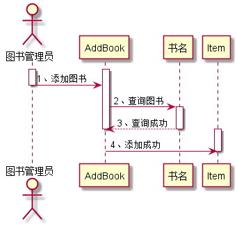

# 实验4：图书管理系统顺序图
|学号|班级|姓名|照片|
|:-------:|:-------------: | :----------:|:---:|
|201510414408|软件(本)15-4|李玥||
----------------
#### 4.1借阅图书
##### 4.1.1 UML源码如下
````
@startuml
actor 图书管理员 as Admin
actor 读者 as Borrower
activate Borrower
activate 借书界面
Borrower->借书界面:登陆
Borrower->借书界面:输入图书编号或书名
借书界面-->借书界面:success
deactivate Borrower
activate Admin
Admin<--借书界面:返回图书信息
deactivate 借书界面
deactivate Admin
activate BorrowBook
Admin->BorrowBook:借阅图书()
activate Admin
Admin<--BorrowBook:return true
BorrowBook->Title:查找图书类()
note right:先查询类目再查询详细书籍
activate Title
Title->BorrowBook:return true
Title->Book:查询图书存在且库存足够
activate Book
Book->Title:return true
deactivate Admin
deactivate BorrowBook
deactivate Title
deactivate Book
Admin->借书界面:添加借书记录
activate Admin
activate 借书界面
Admin<--借书界面:return true
deactivate Admin
deactivate 借书界面
@enduml

````
##### 4.1.2借阅图书时序图如下：


####4.2：还书用例
#####4.2.1 UML源码如下：
````
@startuml
actor 图书管理员 as Admin
actor 读者 as Borrower
activate Borrower
activate 还书界面
Borrower->还书界面:登陆
Borrower->还书界面:输入图书编号或书名
还书界面-->还书界面:successs
deactivate Borrower
activate Admin
Admin<--还书界面:返回图书信息
deactivate 还书界面
deactivate Admin
activate ReturnBook
Admin->ReturnBook:归还图书()
activate Admin
activate Title
activate Book
ReturnBook->Title:查询图书
Title->Book:检查图书破损情况
Title<--Book:检查通过
deactivate Book
ReturnBook<--Title:return true
Admin<--ReturnBook:还书成功
deactivate ReturnBook
deactivate Title
deactivate Admin
Admin->还书界面:添加还书记录
activate Admin
activate 还书界面
Admin<--还书界面:return true
Admin-->Book:更新图书信息
deactivate Admin
deactivate 还书界面
@enduml
````
#####4.2.2 还书用例时序图如下：


####4.3：添加图书
#####4.3.1 UML源码如下：

````
@startuml
actor 图书管理员 as Admin
activate Admin
activate AddBook
Admin -> AddBook:1、添加图书
deactivate Admin
AddBook -> 书名:2、查询图书
activate 书名
AddBook <-- 书名:3、查询成功
deactivate 书名
deactivate AddBook
activate Item
AddBook -> Item:4、添加成功
deactivate Item
@enduml
````
#####4.3.2添加图书时序图如下：



####4.4：删除图书
##### 4.4.1 UML源码如下：

````
@startuml
actor 图书管理员 as Admin
activate Admin
activate Login
activate 删除图书界面
Login->删除图书界面:进入
Admin->Login:登陆
deactivate Admin
deactivate 删除图书界面
Login-->Login:success
删除图书界面->Title:查询图书类目
deactivate Login
activate 删除图书界面
activate Title
Title->Book:查询图书
activate Book
Title<--Book:return true
删除图书界面<--Title:return true
deactivate Title
deactivate Book
deactivate 删除图书界面
删除图书界面->Title:删除图书
activate Title
activate 删除图书界面
删除图书界面<--Title:删除成功
deactivate Title
deactivate 删除图书界面
@enduml
````
#####4.4.2删除图书时序图如下：


##### 4.4.2


#### 4.5：维护图书
#####4.5.1 UML源码如下：

````
@startuml
hide footbox
actor 图书管理员 as admin
participant 维护书籍界面
participant Title
participant book
admin->维护书籍界面:登陆
activate admin
activate 维护书籍界面
维护书籍界面-->维护书籍界面:success

维护书籍界面->Title:维护书目
activate Title
Title-->维护书籍界面:更新成功
维护书籍界面->book:维护书籍
activate book
book-->维护书籍界面:更新成功
维护书籍界面-->admin:退出
deactivate book
deactivate Title
deactivate Title
@enduml
````
#####4.5.2维护图书时序图如下：


