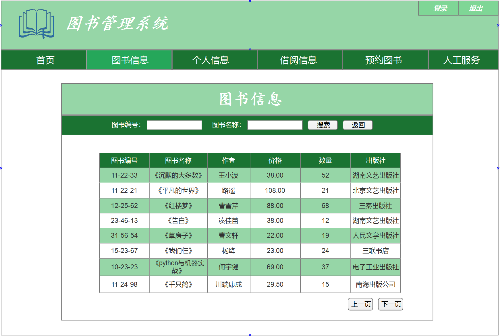

## 实验5：图书管理系统数据库设计与界面设计
|学号|班级|姓名|照片|
|:-------:|:-------------: | :----------:|:---:| 
|201510414408|软件(本)15-4|李玥||

## 1.数据库表设计
### 1.1 图书表
|字段|类型|主键|是否为空|约束|注释|
|:--------:|:------------:|:------:|:----:|:---:|:----:|
|Book_id|char|key|no||图书编号|
|Book_name|varchar||no||图书名称|
|Author|varchar||no||图书作者|
|price|double||no||图书价格|
|quantity|double||yes||图书数量|
|publisher|varchar||yes||出版社|

### 1.2 读者表
|字段|类型|主键|是否为空|约束|注释|
|:--------:|:------------:|:------:|:----:|:---:|:----:|
|reader_id|char|key|no||读者编号|
|password|char||no||密码|
|reader_name|varchar||no||姓名|
|Book_name|varchar||yes||图书名称|

### 1.3 管理员表
|字段|类型|主键|是否为空|约束|注释|
|:--------:|:------------:|:------:|:----:|:---:|:----:|
|Manager_id|char|key|no||管理员id|
|password|char||no||密码|
|Manager_name|varchar||no||管理员姓名|

### 1.4 借阅表
|字段|类型|主键|是否为空|约束|注释|
|:--------:|:------------:|:------:|:----:|:---:|:----:|
|Book_id|char|key|no||图书编号|
|reader_id|char|key|no||读者编号|
|Borrow_time|date||no||借阅时间|
|Return_time|date||no||归还时间|

### 1.5 预约信息表
|字段|类型|主键|是否为空|约束|注释|
|:--------:|:------------:|:------:|:----:|:---:|:----:|
|Order_id|char|key|no||预约者id|
|Order_date|date||no||预约时间|
|Book_id|char|key|no||图书编号|
|Book_name|varchar||no||图书名称|

## 2.界面设计
### 2.1图书信息表：

- 用例图参见：图书用例
- 类图参见：图书类
- 顺序图参见：图书顺序图
- API接口如下：

1. 图书信息API

- 功能：用于获取所有图书信息
- 请求地址： http://localhost:8080/BookManagementSystem/BooksMessage.jsp
- 请求方法：POST
- 请求参数：

|参数名称|必填|说明|
|:-------:|:-------------: | :----------:|
|Book_id|是|图书编号|
|method|是|固定为POST|

- 返回实例：
```
{
    "status_code": "1",
    "data": 
    [
        {
            "Book_name","红楼梦",
            "Borrow_id","12-25-62",
            "author","曹雪芹",
            "Password","12345678"
            "publisher","三秦出版社"
            "price","88.00"
            "Borrow_time","2018/05/08",
            "Return_time","2018/06/05",
        },
        "msg": "响应成功"
    ]
}
```
- 返回参数说明：
    
|参数名称|说明|
|:-------:|:-------------: |
|status_code|状态码（1成功，404失败）|
|data|图书的详细信息|
|msg|请求响应结果|

