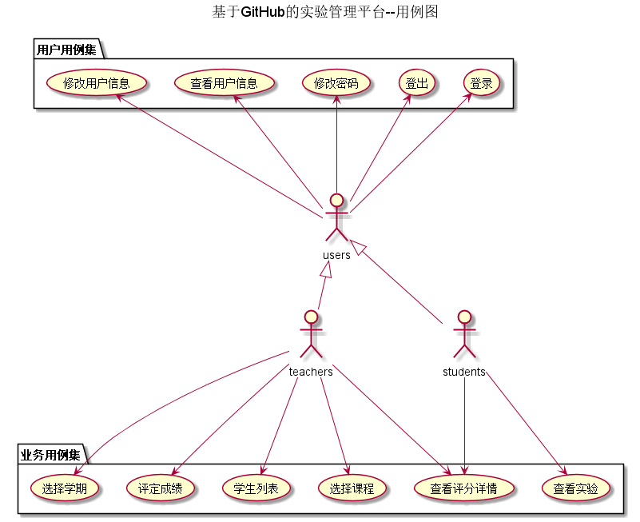

# 实验六：基于GitHub的实验管理平台的分析与设计

|学号|班级|姓名|照片|
|:--:|:--: | :--:|:--:|
|201510414408|软件(本)15-4|李玥||

## 1.概述
基于GitHub的实验管理平台的功能是在线管理实验成绩
- 老师的功能主要有：
1、查看及修改个人信息。2、根据课程在GitHub上发布实验内容。3、批改学生的实验成绩。4、查看学生的实验成绩。
- 学生的功能主要有：
1、查看及修改个人信息。2、根据课程查看老师在GItHUb上发布的试验内容。3、根据实验内容提交试验。4、查询自己的实验成绩。
- 老师和学生都能通过本系统的链接方便地跳转到学生的每个GitHUB实验目录，以便批改实验或者查看实验情况。
- 实验成绩按数字分数计算，每项实验的满分为100分，最低为0分。
- 系统自动计算每个学生的所有实验的平均分。

## 2.系统总体设计

 

## [界面设计](界面设计.PNG)

   
## 3.用例图设计 [源码](src/UseCase.puml)

   
## 4.类图设计 [源码](src/Class.puml)

   
## 5.数据库设计
- ### [参见数据库设计](数据库设计/sql.md)

## 6.用例及界面详细设计

- ### [“登录”用例](用例/登录.md)，   [界面](https://liyue0408.github.io/is_analysis/test6/ui/登录.html)
- ### [“查看用户信息”用例](用例/查看用户信息.md)，   [界面](https://liyue0408.github.io/is_analysis/test6/ui/查看用户信息.html)
- ### [“修改用户信息”用例](用例/修改用户信息.md)，   [界面](https://liyue0408.github.io/is_analysis/test6/ui/查看用户信息.html)
- ### [“修改密码”用例](用例/修改密码.md)，   [界面](https://liyue0408.github.io/is_analysis/test6/ui/查看用户信息.html)
- ### [“登出”用例](用例/登出.md)，   [界面](https://liyue0408.github.io/is_analysis/test6/ui/查看用户信息.html)
- ### [“教师列表”用例](用例/教师列表.md)，   [界面](https://liyue0408.github.io/is_analysis/test6/ui/老师列表.html)
- ### [“学生列表”用例](用例/学生列表.md)
- ### [“成绩列表”用例](用例/成绩列表.md)，   [界面](https://liyue0408.github.io/is_analysis/test6/ui/成绩列表.html)
- ### [“评定成绩”用例](用例/评定成绩.md)，   [界面](https://liyue0408.github.io/is_analysis/test6/ui/评定成绩.html)
- ### [“查看成绩”用例](用例/查看成绩.md)，   [界面](https://liyue0408.github.io/is_analysis/test6/ui/实验成绩详情.html)

