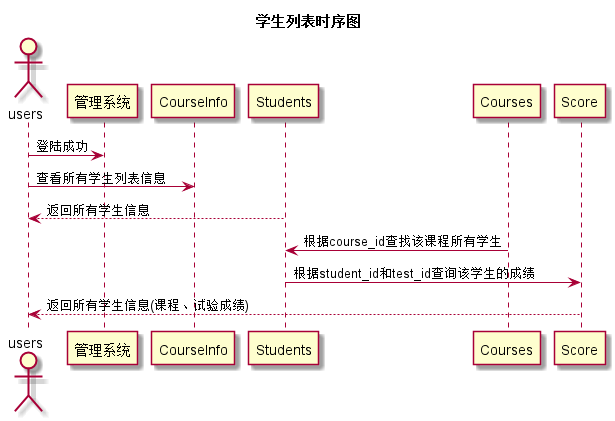

# “学生列表”用例 [返回](../README.md)
## 1. 用例规约

|用例名称|学生列表|
|:--|:--|
|功能|以表形式的显示出学生的信息|
|参与者|管理员，老师|
|前置条件|用户需要先登录|
|后置条件| 根据不同角色显示不同内容|
|主事件流| |
|备选事件流| |

## 2. 界面设计
- 老师的学生列表界面: https://liyue0408.github.io/is_analysis/test6/ui/老师列表.html
- API接口调用
    - 接口：[getStudents](../接口/getStudents.md)

## 3. 时序图[源码](../时序图/学生列表.puml)

## 4. 参照表

- [Students](../数据库设计/sql.md/#Students)
- [Grades](../数据库设计/sql.md/#Grades)
- [Tests](../数据库设计/sql.md/#Tests)
- [ArrangeInfo](../数据库设计/sql.md/#ArrangeInfo)
- [CourseInfo](../数据库设计/sql.md/#CourseInfo)
